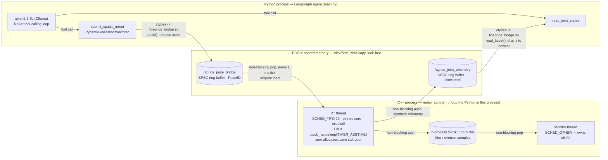

# Agrios

[](https://github.com/Zautzik/agrios/actions/workflows/ci.yml)
[](LICENSE)
[](pyproject.toml)

**A lock-free, PREEMPT_RT-oriented IPC bridge connecting a Python agent to a 1 kHz C++ motor-control loop over POSIX shared memory — zero-copy, wait-free, and built to fail loudly rather than silently degrade when the real-time guarantees it asks for aren't granted.** Verified with a 5,000,000-operation concurrent stress test and a live cross-process, cross-language integration run — see [What's verified, and what isn't](#whats-verified-and-what-isnt) for the honest accounting, including the parts that still need real PREEMPT_RT hardware to mean anything.

## Architecture



The two sides are **fully asynchronous, coupled only through shared memory** — neither ever calls into or blocks on the other. The Python side runs at whatever cadence the LLM decides to call a tool (irregular, on the order of seconds); the C++ side runs at a fixed 1 kHz forever, regardless of whether anything is reading or writing on the other end. `push()`/`pop()` on both channels are `O(1)` and non-blocking by construction (see [The IPC layer](#the-ipc-layer)), so a slow or absent Python process can never stall the control loop, and a slow or absent control loop can never hang a tool call — a full ring buffer just means `push()` returns `false` and the caller decides what to do, not a block.

## The IPC layer

- **POSIX shared memory (`shm_open`/`mmap`)**, not a socket, pipe, or serialized message format — the payload is placed directly at a shared virtual address both processes map, so there is no copy, no serialization/deserialization step, and no kernel round-trip on the hot path.
- **A C++20 lock-free single-producer/single-consumer ring buffer** (template, header-only) sits on top of that raw memory, with explicit `std::memory_order_acquire`/`release` fences — not a mutex, and not the default sequentially-consistent ordering — pairing the producer's release-store of its write index with the consumer's acquire-load of that same index, so a payload write always happens-before the consumer observes it, with no lock in either direction.
- **The control loop never executes inside a Python interpreter at all.** `motor_control_rt_loop` is a separate OS process, built as native C++ — there's no GIL to hold, no reference counting, no interpreter-level nondeterminism anywhere in the timing-critical path, because CPython simply isn't present in that process. Python only ever touches the bridge through a compiled C ABI (`libagrios_bridge.so`) called via `ctypes`, so both languages execute the *exact same* atomic operations — one implementation of the protocol, not a hand-rolled Python-side reimplementation that would only happen to work on x86-64's strong memory model and silently break on a weakly-ordered target like an ARM64 Jetson or Raspberry Pi.
- **Two independent channels, not one bidirectional one** — `Pose6D` (perception → control: translation + Rodrigues rotation vector, the representation `cv2.solvePnP`/ArUco/FoundationPose emit natively) and `JointState6` (control → monitoring: six joint angles). `SPSCRingBuffer` is single-producer/single-consumer by design, so multiplexing two unrelated data flows onto one channel would break that on the first mixed read.
- **The producer side is model-agnostic.** `submit_spatial_intent` doesn't care whether the `tvec`/`rvec` it validates came from an LLM tool call, a classical ArUco marker detector, or a learned VLA policy — the bridge's contract is the Pydantic schema and the shared-memory layout, not the thing generating the numbers. Today that producer is a LangGraph agent reasoning in natural language (see below); swapping in a real perception pipeline changes nothing on the C++ side.

Full design writeup — the memory-ordering contract, the exact byte-offset layout, why a compiled C ABI instead of raw `ctypes` struct-poking — in [cpp/README.md](cpp/README.md).

## Real-time hardening

`motor_control_rt_loop.cpp`'s RT thread, first thing in its body, before touching anything else:

- **`mlockall(MCL_CURRENT | MCL_FUTURE)`**, plus an explicit stack pre-fault — `mlockall` stops pages from being swapped out, but doesn't by itself guarantee a page is *populated* before its first touch, so the thread's stack is also touched once, up front, using a stack explicitly sized for it.
- **`SCHED_FIFO`, priority 99** via `pthread_setschedparam`. Worth knowing rather than glossing over: 99 is the same priority Linux gives several of its own kernel housekeeping threads (e.g. the per-CPU `migration/N` threads) — a misbehaving thread at 99 can starve kernel-internal work the box needs to stay healthy. Real deployments commonly reserve 99 and run application threads at 90–98 for exactly this reason; this code uses 99 because that's the spec, not because it's the recommended default.
- **`pthread_setaffinity_np()`**, pinned to a chosen core. Pinning is not isolation: without also booting the kernel with `isolcpus=`, `nohz_full=`, and `rcu_nocbs=` for that core, the scheduler is still free to run other work there between this thread's slices. That kernel-boot-parameter configuration is a host-level prerequisite this code cannot set up or verify from inside a single process — "pinned" and "isolated" are two different, easily-conflated claims.
- **Zero dynamic allocation and no `std::cout` inside the hot loop.** Every loop-body value is a stack value or a pre-allocated buffer; telemetry exits through the same lock-free ring-buffer primitive, reused for an in-process producer/consumer pair, drained by a separate ordinary-priority thread that owns all the actual I/O — the same shape as ROS 2 control's `RealtimeBuffer`/`RealtimePublisher`.
- **Absolute-deadline scheduling** (`clock_nanosleep(CLOCK_MONOTONIC, TIMER_ABSTIME, ...)`), not a relative sleep — a relative `sleep_for(period)` re-measured from "now" each pass accumulates that pass's own execution time as drift on every iteration; a fixed, monotonically-advancing deadline doesn't.
- **`-Wl,-z,now`** on this executable specifically, forcing eager symbol binding — without it, the *first* call to a dynamically-linked function from inside the hot loop pays for on-demand dynamic-linker resolution, another source of first-touch, hard-to-reproduce latency.

## What's verified, and what isn't

- **The lock-free algorithm: verified.** A real producer thread against a real consumer thread, 5,000,000 items through a deliberately small (256-slot) buffer forcing constant wraparound — zero lost, duplicated, or reordered items, clean under `-Wall -Wextra -Werror`.
- **The cross-process, cross-language bridge: verified live, not asserted from reading the code.** A real `motor_control_rt_loop` process running; a *separate* Python process importing the actual `spatial_tools` module and calling the actual `@tool`-decorated functions — `submit_spatial_intent` delivered a pose, confirmed independently by the RT loop's own telemetry log switching from `pose=no` to `pose=yes` at the exact iteration the push landed; `read_joint_states` then read a live sample back.
- **The failure path: verified, not just the happy path.** `SCHED_FIFO` and `mlockall` both need `CAP_SYS_NICE`/`CAP_IPC_LOCK` or root. Without them, the loop correctly refuses to start and reports why (`Operation not permitted`) instead of silently continuing at normal scheduling — tested by actually removing those capabilities and confirming the refusal, not assumed from the code.
- **Latency/jitter numbers: measured, and explicitly *not* a real-time performance claim.** A 2,000-iteration run showed a 76 μs average and up to several hundred microseconds worst-case; other runs, several milliseconds. Those numbers were measured inside Docker Desktop on WSL2 — a stock, non-PREEMPT_RT-patched kernel, itself inside a VM, with no core isolation configured anywhere in that stack. Every layer of that is exactly what PREEMPT_RT and `isolcpus` exist to eliminate, and none of it was eliminated here. What's genuinely proven: the real-time *mechanisms* work correctly once granted the right privileges, and the absolute-deadline *timing logic* doesn't drift over a sustained run. What's not proven, and isn't claimed: any actual latency bound. That needs a real PREEMPT_RT-patched kernel and a genuinely isolated core to mean anything.
- **Not verified at all: ThreadSanitizer.** `-fsanitize=thread` builds but crashes on launch in this specific Docker-on-WSL2 setup regardless of ASLR/seccomp workarounds tried — read as an environment limitation of this dev machine, not a code issue, given the stress test above already passed clean, but that's a hypothesis, not a fact, until re-tried somewhere the environment isn't in the way.
- **Teardown/signal handling: audited, two real bugs found and fixed.** Neither owner process (`motor_control_consumer`, `motor_control_rt_loop`) originally handled `SIGTERM` — one didn't handle any signal at all — meaning the default termination path skipped `shm_unlink` and orphaned segments in `/dev/shm`. This was live for the entire session and never surfaced, because every verification run used an ephemeral `docker run --rm` container, which destroys `/dev/shm` on exit regardless of whether cleanup code ran. Fixed and reverified directly: sent real `SIGTERM` to both binaries, confirmed each exited on its own (not force-killed) and left `/dev/shm` empty afterward.
- **ABI layout and first-touch page faults: audited against four specific vectors, two real, two not.** `#pragma pack`/extra reordering barriers were requested and correctly *not* added — the structs already have zero padding (proven by a `sizeof` static_assert passing ~10 real compilations) and `std::atomic` acquire/release already is the formal barrier; adding either would have been a regression, not a fix, and that's stated with the reasoning, not just asserted. A demanded conversion of the hot loop to a busy-spin was also declined: it doesn't spin (it blocks on `clock_nanosleep`), and spinning at 1 kHz would burn more power, not less. What *was* real: `mmap()` never used `MAP_POPULATE`, and the ring buffer's payload region was never touched at construction, only `head_`/`tail_` — fixed with an explicit prefault pass (write-touch for the owner, read-only touch for non-owners, since a resident physical page still needs each process's own page-table entry). Also strengthened the cross-language ABI check from a `sizeof`-only comparison to per-field `offsetof` checks, closing a real gap the size check couldn't catch (matching size, silently diverged field order).

Full verification log, including the real bugs the build process itself caught (a `static_assert(offsetof(...))` that didn't compile on an incomplete template type; a concurrency test whose `assert()`-based checks were silently no-ops under `NDEBUG`) — in [NOTES.md](NOTES.md) and [cpp/README.md](cpp/README.md).

## The agent driving it today

The pose intents flowing into the bridge above come from a LangGraph ReAct-style agent reasoning over natural language, on a local Ollama model (`qwen2.5:7b`) — not yet a perception pipeline. The agent itself is a small, fully-instrumented farm-operations assistant: SQL-backed persistence, full tracing, and a 30-case live-model eval suite, described below. It's the thing this repo actually has running end to end today; the bridge is what it's designed to hand off to once a real perception/policy producer is wired in.

```
                ┌──────────┐
   START ─────► │  agent   │ ◄────────┐
                └────┬─────┘          │
                     │  tool_calls?   │
              ┌──────┴──────┐         │
             yes            no        │
              ▼              ▼        │
         ┌─────────┐       END        │
         │  tools  │ ────────────────-┘
         └─────────┘
```

- **`agent` node** — calls the Ollama model (bound to 7 tools) with the running message history.
- **`tools` node** — executes whichever tool(s) the model requested, returns results as `ToolMessage`s.
- **Conditional edge** — routes back to `tools` only while the model keeps requesting them; exits to `END` the moment it answers directly.
- **Checkpointing** — `SqliteSaver` persists graph state per `thread_id` to `checkpoints.db`, so multi-turn memory survives a process restart, not just a single run.

### Demo

A real, unedited transcript from a live run against `qwen2.5:7b` — a plain conversational turn followed by a tool-calling turn resolved against the actual SQLite-backed field data:

```
You: Hi, who are you?
Hello! I'm Qwen, an AI assistant created by Alibaba Cloud. My main goal is to help you with
any questions or tasks related to agriculture, weather forecasts, and more. How can I assist
you today? Whether you need information about planting, managing fields, or anything else
related to your farming activities, feel free to ask!

You: What is the status of field-1?
The current status of field-1 is that it contains potatoes which are currently growing.

Would you like to log a task for field-1 or need more information about the crop?
```

(`query_field_status(field_id="field-1")` was called under the hood and returned the real row from `agrios.db`.)

### Tools

| Tool | Purpose |
|---|---|
| `get_weather_forecast(location, days=7)` | Forecast for planting/irrigation/frost-risk timing |
| `lookup_crop_calendar(crop, region)` | Planting and harvest windows for a crop |
| `query_field_status(field_id)` | Current crop and status for a field |
| `log_task(field_id, description)` | Records a pending task against a field |
| `get_pending_tasks()` | Lists all pending tasks across fields |
| `submit_spatial_intent(tvec, rvec)` | Pydantic-validated 6D pose, pushed onto the C++ motor-control bridge |
| `read_joint_states()` | Reads live joint-angle telemetry from the motor-control bridge |

`get_weather_forecast` and `lookup_crop_calendar` currently return fixture data — they're shaped to be swapped for real API calls without changing their interface. The last two are defined in [spatial_tools.py](spatial_tools.py), not `main.py`, and degrade to a plain string result (not a crash) when the C++ side isn't available — true by default on this project's own Windows dev machine, since POSIX shared memory doesn't exist there.

### Design decisions

A few choices here were deliberate, not defaults — worth knowing why if you're reading the code:

- **Recursion limit set explicitly (`10`), not left at LangGraph's default (`25`).** The `agent → tools → agent` cycle's exit condition depends entirely on model judgment; a local 7B model can get stuck re-calling a tool with bad args. Capping it tighter than the library default catches a stuck loop faster, and it's caught explicitly via `GraphRecursionError` so the CLI degrades to a message instead of crashing.
- **Exception handling is scoped to where failure is actually possible, not blanket-applied.** The three tools that touch SQLite catch `SQLAlchemyError`, scoped to real I/O. The two tools that return static data don't have a try/except at all — there's nothing there that can fail yet, and a bare `except Exception` around code that can't throw just masks future bugs instead of guarding anything real. At the model-call boundary, the ollama client's streaming and non-streaming code paths have different exception contracts: `_request_raw()` wraps `httpx.ConnectError` in Python's builtin `ConnectionError`, but the streaming path used by `ChatOllama` (`inner()`) does not — it lets `httpx.ConnectError` propagate unwrapped. Catching the right types required reading the client source, not guessing from the class hierarchy. The except tuple covers `ollama.ResponseError` (model-side error), `ConnectionError` (non-streaming path, server unreachable), and `httpx.ConnectError` (streaming path, TCP connection refused) — each for a confirmed failure mode, not defensive coverage.
- **Domain data sits behind a SQLAlchemy engine, not raw `sqlite3` calls.** Every tool goes through one `engine` object with explicit connection pooling (`QueuePool`). At this scale that's not solving a real concurrency problem — it's a single-threaded CLI — but it means the only thing that changes to move to Postgres later is the connection string on one line; no tool function needs to change.
- **Database paths are anchored to the project directory, not CWD.** Both `agrios.db` and `checkpoints.db` resolve through `Path(__file__).parent` rather than relative URI strings. A relative path in a SQLAlchemy connection string (`sqlite:///file.db`) resolves to whatever the process's current working directory is at runtime — not where the code lives. That's an ambient property of how the script was invoked, not a stable code decision. Anchoring to `__file__` makes the file location an explicit invariant rather than something that silently varies depending on where you launched the process from.
- **Tracing via self-hosted Langfuse, not LangSmith.** A `CallbackHandler` is wired into the LangGraph `invoke` config, giving full per-node trace spans (model input/output, tool name/args/result) without depending on a paid hosted service.

### Evaluation

A 30-case parametrized suite (`test_agent.py`, run via `pytest -m slow`) checks the live model
across four categories: tool selection (15 cases), argument correctness (8), multi-step task
completion (5), and no-tool-needed (2). It's gated behind a marker so a plain `pytest` run stays
fast and never touches Ollama; the full suite takes ~25 minutes on CPU against `qwen2.5:7b`.

**Reconciled result** (original run + one test-bug fix, not a single re-run): **28/30 cases
correct.**
- 1 confirmed, reproducible gap: the literal phrasing *"What's the weather forecast for
  field-1?"* — wording closest to the tool's own docstring — doesn't trigger
  `get_weather_forecast` (3/3 across independent isolated runs), while paraphrases of the same
  request reliably do. Not yet fixed.
- 1 open question: a single recursion-limit hit on a frost-risk question didn't reproduce on
  retry (1 fail, 1 pass across everything actually run) — too little data to call it resolved or
  call it a bug, so it's a watch item.

See [NOTES.md](NOTES.md) for the full investigation, including a hypothesis (cold-start effect)
that got tested and killed before either finding was written down.

Note: adding `submit_spatial_intent`/`read_joint_states` gave the model 7 tools instead of 5 to
choose from; the eval suite above has not been re-run since, so it doesn't yet confirm the new
tools left the other 5's selection behavior unaffected.

## Stack

- [LangGraph](https://github.com/langchain-ai/langgraph) — agent control flow as an explicit graph
- [LangChain](https://github.com/langchain-ai/langchain) + [`langchain-ollama`](https://github.com/langchain-ai/langchain) — model/tool binding
- [Ollama](https://ollama.com/) (`qwen2.5:7b`) — local inference, no API cost or external dependency
- [SQLAlchemy](https://www.sqlalchemy.org/) — pooled connections over SQLite (`agrios.db`), portable to Postgres
- `langgraph-checkpoint-sqlite` — conversation persistence (`checkpoints.db`)
- [Langfuse](https://langfuse.com/) (self-hosted) — full tracing/observability
- [`uv`](https://github.com/astral-sh/uv) — Python dependency management
- C++20, CMake, POSIX shared memory, `pthread` — the real-time bridge (`cpp/`), Linux/macOS only

Full build log → [NOTES.md](NOTES.md) &nbsp;·&nbsp; From-first-principles study guide → [docs/Masterclass-Agrios.md](docs/Masterclass-Agrios.md)

## Setup

**Prerequisites:** [Ollama](https://ollama.com/download) installed and running, [`uv`](https://github.com/astral-sh/uv) installed, [Docker Desktop](https://www.docker.com/products/docker-desktop/) (for tracing, and for building/running `cpp/` on Windows — see [cpp/README.md](cpp/README.md)).

```bash
# 1. Pull the model
ollama pull qwen2.5:7b

# 2. Install dependencies
uv sync

# 3. (optional) bring up self-hosted Langfuse for tracing
git clone https://github.com/langfuse/langfuse.git langfuse-server
cd langfuse-server && docker compose up -d
# open http://localhost:3000, sign up, create a project, generate an API key
```

Create a `.env` in the project root:
```
LANGFUSE_PUBLIC_KEY="pk-lf-..."
LANGFUSE_SECRET_KEY="sk-lf-..."
LANGFUSE_BASE_URL="http://localhost:3000"
```

Run it:
```bash
uv run main.py
```
Type a message at the `You:` prompt; type `exit` to quit. Tables and seed data (`agrios.db`) are created automatically on first run.

To build and run the C++ bridge itself (Linux/macOS, or a container — see [cpp/README.md](cpp/README.md) for the full walkthrough including the real-time loop):
```bash
cmake -S cpp -B cpp/build -DCMAKE_BUILD_TYPE=RelWithDebInfo
cmake --build cpp/build
ctest --test-dir cpp/build --output-on-failure
```

## Known limitations

- **No VLA/perception pipeline is wired in.** `submit_spatial_intent` is exercised today by an LLM tool call reasoning from natural language, not by a vision or learned-policy model — the bridge is producer-agnostic by design, but nothing in this repo currently produces `tvec`/`rvec` from vision.
- **No real hardware, no real joints.** `JointState6` telemetry is a synthetic waveform published by the RT loop, a stand-in for real encoder feedback — there is no motor, encoder, or physical arm behind this yet.
- **No PREEMPT_RT kernel has been used.** Every real-time verification above ran on a stock kernel inside a VM/container — see [What's verified, and what isn't](#whats-verified-and-what-isnt).
- `get_weather_forecast` and `lookup_crop_calendar` return fixture data, not live API results.
- Single `thread_id` ("1") is hardcoded — no per-user session handling. In practice this also means history only grows: after ~2 months of development sessions the persisted thread had accumulated 25+ messages, and every subsequent turn replays all of it through the model before generating — confirmed to noticeably slow interactive turns (30s–2min on CPU) that would otherwise be quick. No trimming/summarization is implemented yet.
- `qwen2.5:7b` needs ~4.3 GB free RAM to load; on a constrained machine running Docker simultaneously, this can fail — handled gracefully (see Design decisions) rather than crashing, but worth knowing going in.
- Langfuse trace export is currently failing in local verification (`Read timed out`, then `404 Not Found` from the OTLP endpoint) — traces are not being recorded even though the agent itself runs fine, since export happens on a non-blocking background path. Root cause not yet investigated; most likely an SDK/server version mismatch on the self-hosted instance.
